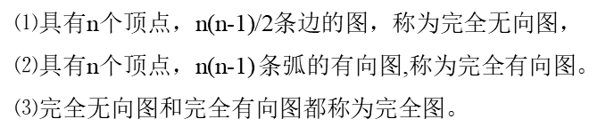

# 无向图
- # 形式:
  id:: 62ccdceb-1d90-46d2-9c63-31042c74d2d0
  
  在无向图中:一条边（x,y）与（y,x）表示的结果相同，用圆括号表示，
  
  
# 图G的顶点数n和边数e的关系

0≤e≤n(n-1)/2。

恰有n(n-1)/2条边的无向图称无向完全图(Undireet-ed Completepa
# 例题

[无向图](%E6%97%A0%E5%90%91%E5%9B%BE%20aabfcc74b50c4b86b3f9c8e7926d2a0a.md) [设无向图G=(V,E)和G' =(V',E' )，如果G'是G的生成树，则以下说法错误的是](../%E6%95%B0%E6%8D%AE%E7%BB%93%E6%9E%84%206c6673ee9a5944b887f4e7681d3421ef.md)