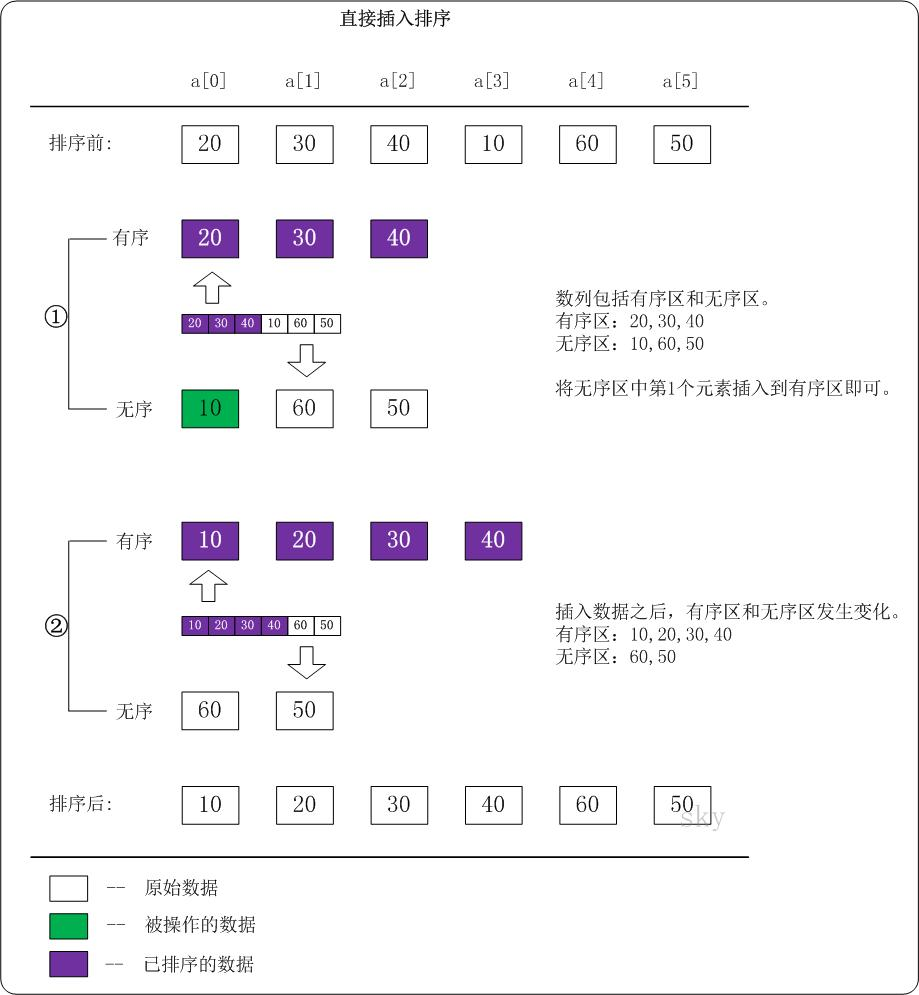

# 直接插入排序
# **直接插入排序的时间复杂度和稳定性**

**直接插入排序时间复杂度**直接插入排序的时间复杂度是**O(N^2)**。假设被排序的数列中有N个数。遍历一趟的时间复杂度是O(N)，需要遍历多少次呢？N-1！因此，直接插入排序的时间复杂度是O(N^2)。

**直接插入排序稳定性**直接插入排序是稳定的算法，它满足稳定算法的定义。算法稳定性 -- 假设在数列中存在a[i]=a[j]，若在排序之前，a[i]在a[j]前面；并且排序之后，a[i]仍然在a[j]前面。则这个排序算法是稳定的！
- # 排序趟数
  
  每排序一趟则有序区间+1,无序区间-1,有序区间从0开始
  
  假设{20,30,40,10,60,50}中的前3个数已经排列过，是有序的了；接下来对10进行排列。示意图如下：
  
  